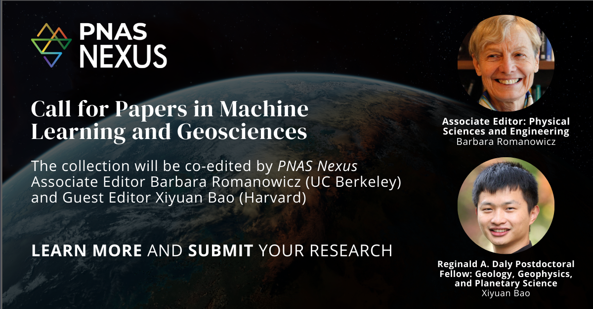

PNAS Nexus, the sister journal of PNAS (a gold open-access journal), has announced a call for papers for a special issue on “Machine Learning and Geosciences.” No publication fees will be charged. Submissions are welcome on the application and methodological advancement of machine learning in geosciences. The journal targets a broad scientific audience and encourages interdisciplinary research with wide impact. Accepted papers will be published online on a rolling basis.
This special issue will be co-edited by Barbara Romanowicz (UC Berkeley) and Xiyuan Bao (Harvard). The submission deadline is March 15, 2026.
To express your interest and obtain submission instructions, please contact the editorial office at pnasnexus.editorialoffice@oup.com. For more details, please refer to [this link](https://academic.oup.com/pnasnexus/pages/call-for-papers-in-machine-learning-and-geosciences).
We warmly welcome your submissions and would greatly appreciate your help in sharing this call with colleagues.

